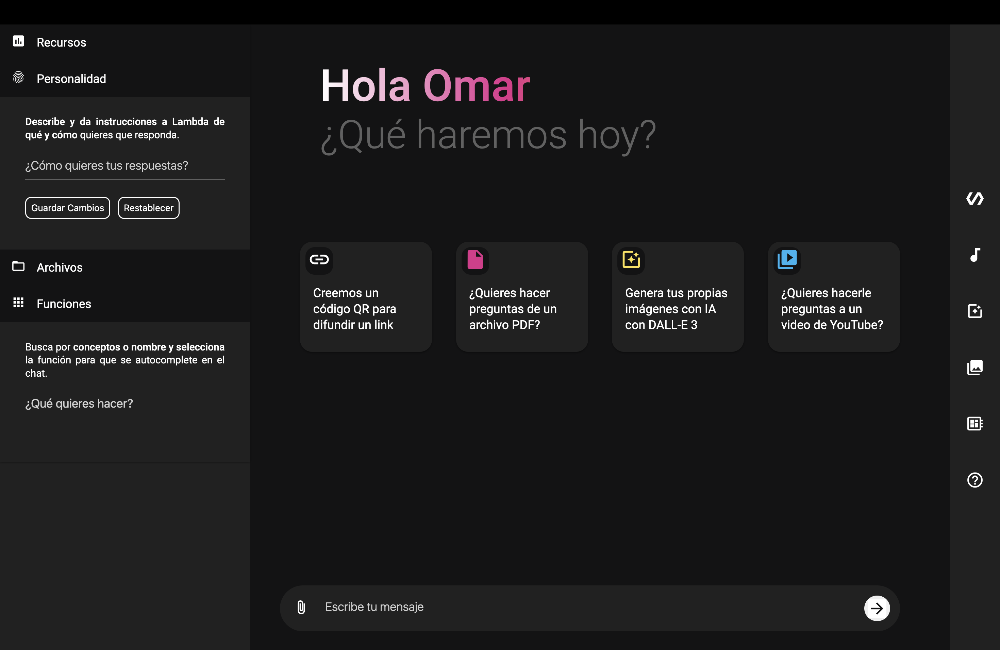
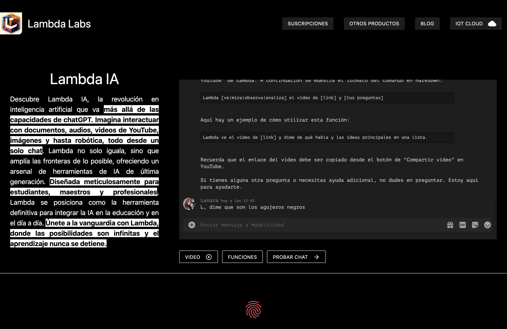
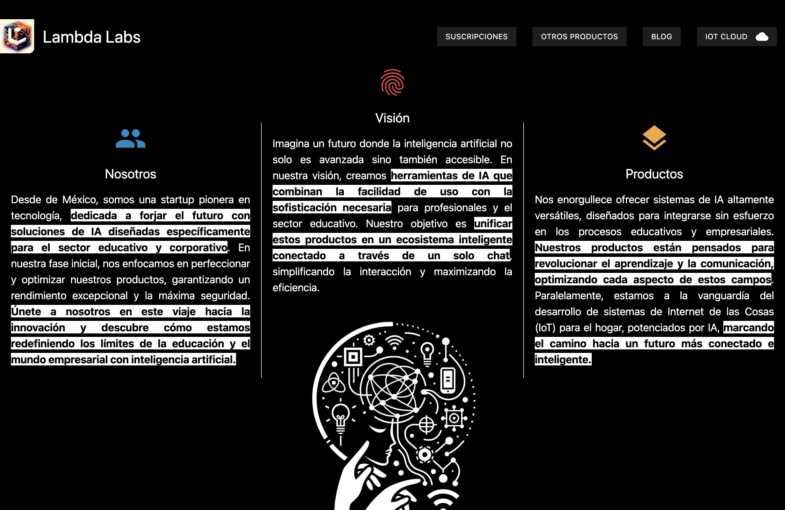
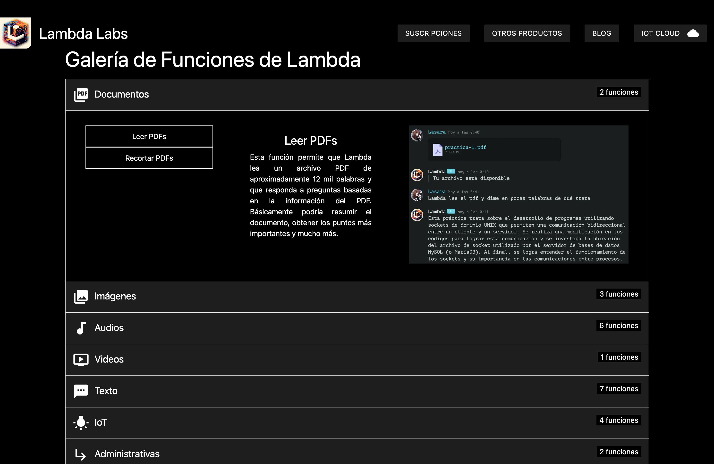
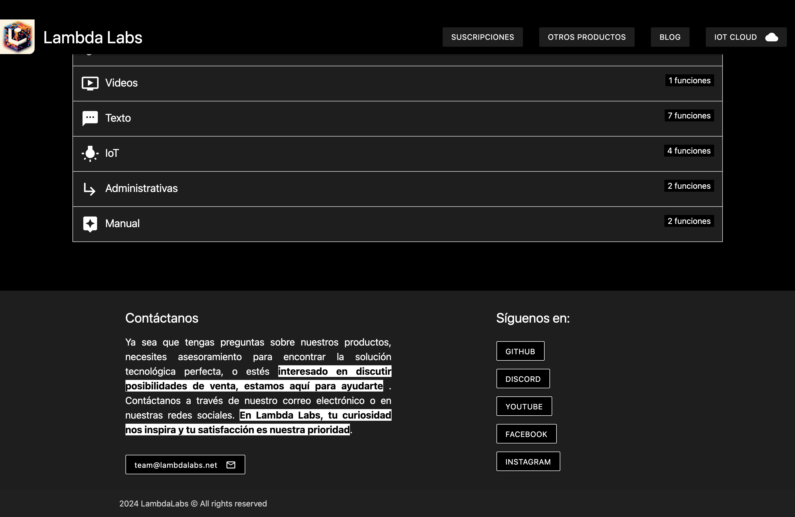

# Lambda Labs Web

**Lambda Labs Web** fue una página web hosteada en [lambdalabs.net](https://lambdalabs.net) que presenta un asistente virtual impulsado por IA llamado **Lambda**. Este sitio está dedicado a anunciar la **versión beta** de Lambda AI, accesible en [este repositorio](https://github.com/OmarSaldanna/Lambda).

## Descripción del Chat de Lambda

Lambda es una IA avanzada diseñada para facilitar la interacción con usuarios a través de un chat enriquecido con múltiples capacidades. Su propósito principal es brindar soporte integral en diversas tareas, desde manejar consultas de texto hasta realizar operaciones más complejas. A continuación se describe su funcionalidad principal:

### Capacidades del Chat de Lambda

Lambda Assistant cuenta con un conjunto de habilidades para optimizar la experiencia del usuario:

- **Almacenaje y manejo de archivos**: Permite cargar, guardar y gestionar archivos dentro del chat.
- **Limpieza automática de contexto**: Para eficientar las conversaciones, Lambda implementa un sistema de limpieza automática del contexto, manteniendo sólo la información relevante.
- **Links directos**: Facilita la interacción al proporcionar enlaces directos a los recursos mencionados en la conversación.
- **Manejo de audios y creación de imágenes**: Lambda es capaz de procesar archivos de audio y generar imágenes bajo demanda.
- **Interacción con PDFs y QRs**: Soporta carga y análisis de documentos PDF, así como generación y escaneo de códigos QR.
- **Conexión con IoT**: Lambda Assistant se integra con la plataforma IoT de Lambda, compatible con dispositivos como Arduino, Raspberry Pico y ESP32. Más detalles sobre esta funcionalidad pueden encontrarse en el repositorio de [lambda-iot-client](https://github.com/OmarSaldanna/lambda-iot-client).

## Vistas de la Página

A continuación se presentan las principales vistas de la página web, disponibles en la carpeta `demos/`:

- **Página principal**: Una introducción a las capacidades del chat.
  

- **Anuncio de la Beta**: Información detallada sobre el acceso anticipado a la beta.
  

- **Demostraciones de Skills de Lambda**: Ejemplos de cómo utilizar las diferentes habilidades de Lambda.
  

- **Conexión IoT**: Instrucciones y ejemplos de cómo interactuar con dispositivos IoT desde el chat.
  

## Instalación y Uso

Para utilizar el chat de Lambda, dirígete a [Lambda Assistant Web](https://lambdalabs.net) e inicia la conversación con Lambda para explorar todas sus funcionalidades. 

---

Lambda Assistant Web es una plataforma en constante desarrollo, por lo que tu retroalimentación es importante. Si tienes alguna sugerencia o detectas algún problema, no dudes en abrir un issue en el [repositorio principal](https://github.com/OmarSaldanna/Lambda).
